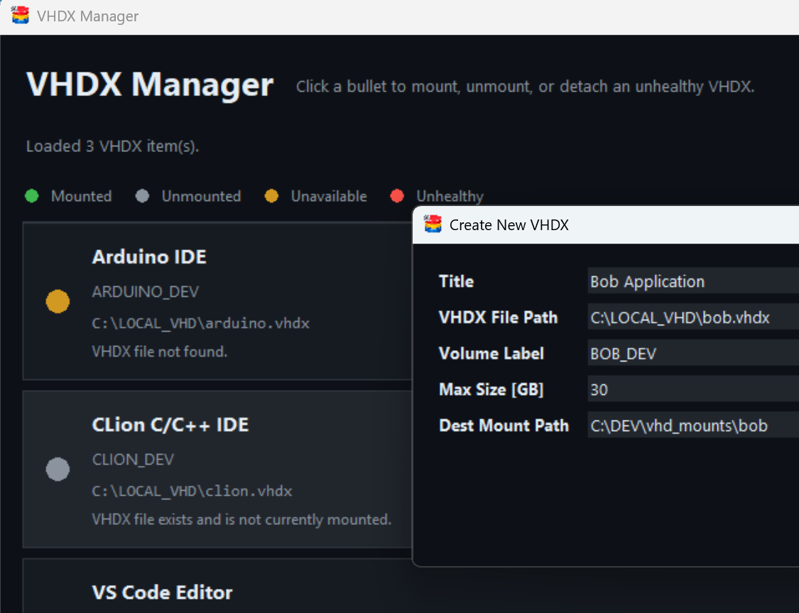
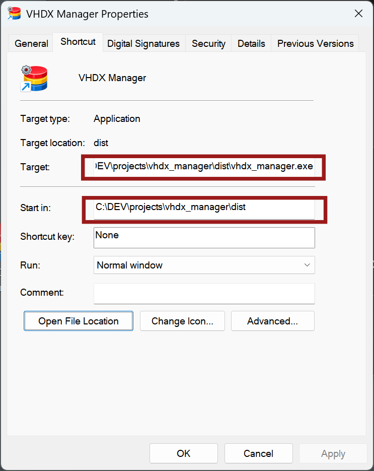
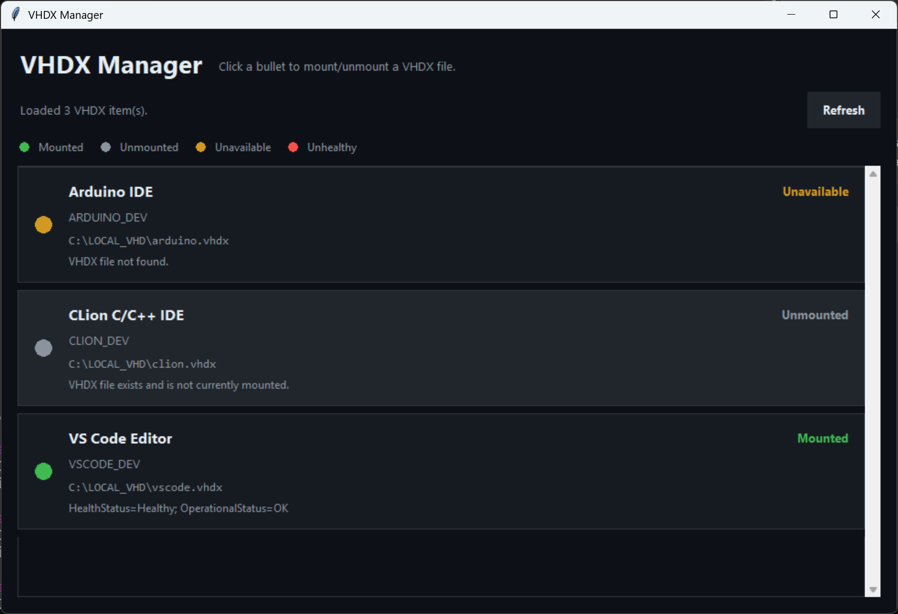

# VHDX Manager

This Python application for Microsoft Windows can be used to easily attach/detach (i.e. mount/unmount) Virtual Hard Disk (.vhdx) files present in a JSON file called **vhdx_list.json** (if you modify the JSON file manually, restart the app to re-read the file).

You can also create new VHD files by clicking the Create New VHD button in the app, and the app will automatically insert to the vhdx_list.json file.

Simply click the colored bullet alongside the desired VHD, to toggle between mounted and unmounted states. It may take a few seconds to perform the action.



# Example Use-Cases

You could use VHDX manager to create a virtual hard disk (VHD) for installing a single application inside it, and repeat this for all other applications if desired. Then, if you find you don't need any particular applications for a while, but wish to free up some space on your PC, you could simply unmount VHDs, and then move those VHD files off your PC to slower or cheaper storage (e.g. spinning disk rather than a solid-state drive), or even offload them to the cloud. This saves having to uninstall and reinstall apps, plus, it's more reliable to transfer and maintain VHD files rather than the hundreds or thousands of small files that could make up each application.

The VHD files provide a lot of flexibility. If, say, you have a speedy USB 4 connection (for example, Thunderbolt-capable), then you could transfer the VHD to a fast USB drive, and directly mount it from there to a folder on your local PC, so that the application in effect is running from the external drive, again saving storage space on your PC. This could be useful if your PC's internal drive is getting full and you don't wish to replace it. 

# Running VHDX Manager

If you have **git** installed on your Windows PC, then create a folder such as C:\DEV\projects, open a PowerShell window, navigate to that folder, then type the following to download the entire application source to the PC:
```
git clone https://github.com/shabaz123/vhdx_manager.git
```

From PowerShell, go to the vhdx_manager folder, and type:
```
python .\vhdx_manager.py
```
You may be requested to elevate to administrator privileges.

Alternatively, create a Windows executable by typing the following in a PowerShell window, from the vhdx_manager folder:
```
pip install pyinstaller
.\build.bat
```
The **.\build.bat** command will create a **dist** folder containing **vhdl_manager.exe**. You can create a Windows desktop shortcut to that file if desired, see the screenshot below. You can copy the shortcut to **C:\ProgramData\Microsoft\Windows\Start Menu\Programs** for it to appear in the Start Menu.



When run, a graphical window appears. It may take a few seconds to display the list of VHDs. Click on the colored bullets to attach or detach any VHD.



